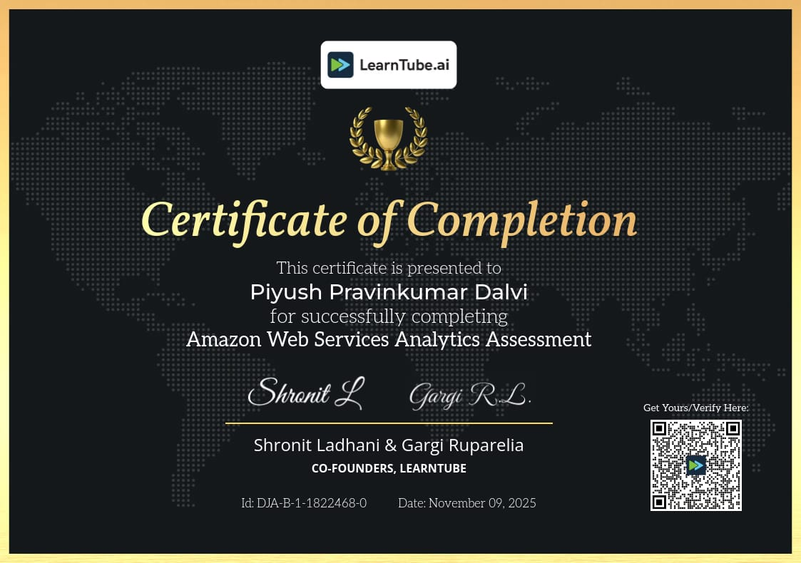

<!-- ===================== HERO BANNER ===================== -->

  

<!-- ===================== BADGES ===================== -->

  
  

  

---

## About Me

I am **Piyush Dalvi**, a **DevOps Engineer (Fresher)** with hands-on experience in  
**AWS cloud infrastructure, configuration management, and CI/CD automation**.

I focus on building **automated, scalable, and reliable systems** using Infrastructure as Code and DevOps best practices.

- AWS Cloud (EC2, VPC, IAM, S3)
- Ansible for configuration management
- Terraform for Infrastructure as Code
- Jenkins CI/CD pipelines
- Linux system administration

---

## DevOps Mindset

> Automation is not an option, it is a requirement.

- Reduce manual configuration
- Use Infrastructure as Code
- Automate deployment pipelines
- Build repeatable and reliable systems

---

## Skills & Tools

  

---
## Certifications

### Amazon Web Services Analytics Assessment  
**Platform:** LearnTube.ai  
**Description:**  
Successfully completed an assessment focused on Amazon Web Services analytics concepts.  
This certification validates foundational understanding of AWS services, cloud analytics, and real-world cloud use cases.

**Issued By:** LearnTube.ai  
**Date:** November 09, 2025  
**Credential ID:** DJA-B-1-1822468-0

## Core Competencies

AWS Cloud Infrastructure
DevOps Engineering
Ansible Automation
Terraform Infrastructure as Code
CI/CD Pipeline Implementation
Linux System Administration
Application Deployment on EC2
Cloud Security Basics

## Connect With Me

- GitHub: https://github.com/dalvipiyush07
- LinkedIn: https://www.linkedin.com/in/piyush-dalvi-5b1499382
- Medium: https://medium.com/@dalvipiyush07
- Email: piyushdalvi65@gmail.com

